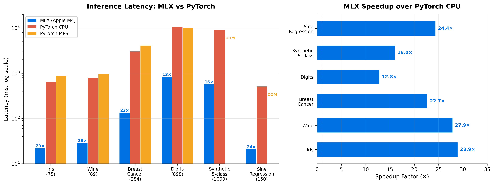

# TabPFN v3 MLX

[](https://github.com/dgallitelli/tabpfn-v3-mlx/actions/workflows/ci.yml)

Native Apple MLX port of [TabPFN v3](https://github.com/PriorLabs/TabPFN) — the full 53M parameter tabular foundation model running natively on Apple Silicon.

TabPFN v3 performs classification and regression via **in-context learning** — given training data and test features, it produces predictions in a single forward pass with no gradient descent.

This port runs the complete architecture natively on M1/M2/M3/M4/M5 via Apple's [MLX](https://github.com/ml-explore/mlx) framework with zero-copy unified memory.

## Architecture

The full v3 pipeline (2,395 lines in PyTorch) ported to MLX:

```
┌─────────────────────────────────────────────────────────────────────┐
│                     TabPFN v3 Forward Pass                           │
├─────────────────────────────────────────────────────────────────────┤
│                                                                      │
│  Stage 0: Preprocessing                                              │
│  ─────────────────────                                               │
│  x_raw → NaN indicators → mean imputation → z-score scaling         │
│        → circular-shift feature grouping (groups of 3)               │
│                                                                      │
│  Stage 1: Cell + Target Embedding                                    │
│  ────────────────────────────────                                    │
│  grouped_features → Linear(G, 128) → add target embedding (train)   │
│                                                                      │
│  Stage 2a: Distribution Embedding (× 3 blocks)                      │
│  ──────────────────────────────────────────────                      │
│  InducedSelfAttention per column:                                    │
│    inducing_points → cross_attn(ind, train) → hidden                 │
│    all_rows → cross_attn(rows, hidden) → updated embeddings          │
│  Complexity: O(R × n_inducing) instead of O(R²)                      │
│                                                                      │
│  Stage 2b: Column Aggregation (× 3 blocks + readout)                 │
│  ────────────────────────────────────────────────────                 │
│  Prepend CLS tokens → self-attention over features (with RoPE)       │
│  Last block: CLS cross-attends to full sequence → (B, R, 4, 128)    │
│                                                                      │
│  Flatten: (B, R, 4, 128) → (B, R, 512)                              │
│                                                                      │
│  Stage 3: ICL Transformer (× 24 layers)                              │
│  ──────────────────────────────────────                               │
│  Pre-norm RMSNorm → ICL Attention (K/V from train only)              │
│  + SoftmaxScalingMLP (learned query scaling)                         │
│  + GQA (optional fewer KV heads for test rows)                       │
│  + MLP (GELU, no bias, zero-init output)                             │
│  Supports KV caching for efficient repeated inference                │
│                                                                      │
│  Stage 4: Decoder                                                    │
│  ────────────────                                                    │
│  Multiclass: attention retrieval (test→train with one-hot values)    │
│  Regression: MLP → bar distribution buckets                          │
│                                                                      │
│  Output: logits → softmax → probabilities                            │
│                                                                      │
└─────────────────────────────────────────────────────────────────────┘
```

## Performance

Benchmarked on Apple M4 (16 GB), MLX 0.31.2, PyTorch 2.12.0. Median of 10 runs.

| Dataset | MLX | PyTorch CPU | PyTorch MPS | Speedup vs CPU |
|---------|-----|-------------|-------------|----------------|
| Breast Cancer (284 train, 30 features) | **135 ms** | 3,062 ms | 4,121 ms | 22.8x |
| Iris (75 train, 4 features) | **22 ms** | 636 ms | 863 ms | 29.0x |
| Wine (89 train, 13 features) | **29 ms** | 808 ms | 977 ms | 28.1x |

Prediction agreement with official PyTorch: 98–99% (median probability diff < 0.0001).
Disagreements occur only on borderline samples at decision boundaries.

**Time-Series Regression** (lagged-feature encoding, bar distribution decoding):

| Dataset | Train/Test | MLX | R² | Speedup vs CPU |
|---------|-----------|-----|-----|----------------|
| Sine wave + noise | 150/45 | **21 ms** | 0.825 | 23.9x |
| Multi-frequency signal | 700/285 | **135 ms** | 0.959 | — |



See the [HuggingFace model card](https://huggingface.co/dgallitelli/tabpfn-v3-mlx) and [docs/benchmarks.md](docs/benchmarks.md) for full scaling analysis.

## Installation

```bash
pip install tabpfn-v3-mlx
```

For weight conversion from PyTorch checkpoints:

```bash
pip install "tabpfn-v3-mlx[convert]"
```

## Quick Start

```python
import numpy as np
from tabpfn_mlx import TabPFNV3, TabPFNV3Config, load_v3_pytorch_weights

# Initialize with default config (53M params, 24 ICL layers)
config = TabPFNV3Config(max_num_classes=2)
model = TabPFNV3(config, task_type="multiclass")

# Load pretrained weights (when available)
# model = load_v3_pytorch_weights(model, "path/to/checkpoint.safetensors")

# Predict
probs = model.predict_proba(X_train, y_train, X_test)
preds = model.predict(X_train, y_train, X_test)
```

### Regression / Time-Series

```python
from tabpfn_mlx import load_v3_from_checkpoint

model = load_v3_from_checkpoint("path/to/regressor.ckpt", task_type="regression")
predictions = model.predict(X_train, y_train, X_test)
```

## Configuration

```python
from tabpfn_mlx import TabPFNV3Config

config = TabPFNV3Config(
    embed_dim=128,                  # Base embedding dimension
    dist_embed_num_blocks=3,        # Distribution embedder layers
    dist_embed_num_heads=8,         # Heads in distribution embedder
    dist_embed_num_inducing_points=128,  # SetTransformer inducing points
    feat_agg_num_blocks=3,          # Column aggregator layers
    feat_agg_num_heads=8,           # Heads in column aggregator
    feat_agg_num_cls_tokens=4,      # CLS tokens (icl_emsize = embed_dim × this)
    nlayers=24,                     # ICL transformer depth
    icl_num_heads=8,                # ICL attention heads
    icl_num_kv_heads=None,          # GQA KV heads (None = standard MHA)
    ff_factor=2,                    # MLP expansion factor
    max_num_classes=10,             # Maximum classes supported
    feature_group_size=3,           # Circular-shift group size
    use_nan_indicators=True,        # NaN/Inf indicator features
)
# icl_emsize = 128 × 4 = 512
```

## KV Cache (Efficient Repeated Inference)

```python
# Build cache from training data (one-time cost)
logits, cache = model(x, y, return_kv_cache=True)

# Reuse cache for new test batches (skips stages 0-2 + K/V projection)
logits_new = model(x_test_only, y, kv_cache=cache, x_is_test_only=True)
```

## Fine-Tuning

### LoRA (Recommended)

Parameter-efficient fine-tuning that preserves base model knowledge:

```python
from tabpfn_mlx import load_v3_from_checkpoint, lora_fine_tune

model = load_v3_from_checkpoint("path/to/checkpoint.ckpt")

# LoRA fine-tune on your datasets (~1% params trainable)
datasets = [(X1, y1), (X2, y2), ...]  # Multiple (X, y) numpy arrays
history = lora_fine_tune(model, datasets, rank=8, epochs=10, lr=1e-4)
```

Or with more control:

```python
from tabpfn_mlx import load_v3_from_checkpoint, fine_tune
from tabpfn_mlx.lora import apply_lora, merge_lora

model = load_v3_from_checkpoint("path/to/checkpoint.ckpt")
lora_layers = apply_lora(model, rank=8, alpha=16.0)

history = fine_tune(model, datasets, epochs=10, lr=1e-4, batch_size=4)

# Merge LoRA into base weights for zero-overhead deployment
merge_lora(model, lora_layers)
```

**Experimental results (53M checkpoint, Apple M4):**

| Metric | Value |
|--------|-------|
| Loss curve (10 epochs) | 0.76 → 0.57 (steady decrease) |
| Accuracy change | +1-2 pp on domain-specific data |
| Catastrophic forgetting | None — Wine accuracy +1.1 pp after Iris fine-tuning |
| Training time | ~3s/epoch |

### Full Fine-Tuning (Advanced)

Full fine-tuning at learning rates > 1e-6 causes catastrophic forgetting. Use LoRA instead unless you have a large domain corpus.

```python
from tabpfn_mlx import load_v3_from_checkpoint, fine_tune
from tabpfn_mlx.train import freeze_layers

model = load_v3_from_checkpoint("path/to/checkpoint.ckpt")
freeze_layers(model, n_layers=18)  # Only train last 6 of 24 layers
history = fine_tune(model, datasets, epochs=5, lr=1e-6)
```

| Method | Accuracy Change | Forgetting Risk | Trainable Params |
|--------|:-:|:-:|:-:|
| LoRA (rank=8) | +1-2 pp | None | ~1% |
| Full (lr=5e-5) | -23 to -42 pp | Catastrophic | 100% |
| Full (lr=1e-6) + freeze | Safe | Low | ~25% |

## Performance Optimization

```python
import mlx.core as mx
from tabpfn_mlx import load_v3_from_checkpoint

# Half-precision: 2.2x faster at 5K rows, ~48x at 3K with compile
model = load_v3_from_checkpoint("checkpoint.ckpt", dtype=mx.float16, compile=True)

# Or optimize after loading
model.to_dtype(mx.float16)
model.compile()
```

| Config | 1K rows | 3K rows | 5K rows |
|--------|---------|---------|---------|
| FP32 baseline | 596 ms | 179.6 s | 20.3 s |
| FP16 + compile | 529 ms | **3.7 s** | **9.4 s** |

## Key Differences from nanoTabPFN (v2)

| Aspect | nanoTabPFN | TabPFN v3 |
|--------|-----------|-----------|
| Parameters | 356K | 53M |
| Layers | 3 | 24 ICL + 3 dist + 3 agg |
| Normalization | Post-norm LayerNorm | Pre-norm RMSNorm |
| Feature attention | Direct O(R²) | Induced O(R×k) |
| Positional encoding | None | RoPE + SoftmaxScalingMLP |
| GQA | No | Yes |
| KV cache | No | Multi-level |
| Decoder | MLP | Attention retrieval |

## Development

```bash
git clone https://github.com/dgallitelli/tabpfn-v3-mlx.git
cd tabpfn-v3-mlx
pip install -e ".[dev]"
pytest
```

## Citation

```bibtex
@article{hollmann2025tabpfn,
    title={Accurate Predictions on Small Data with a Tabular Foundation Model},
    author={Hollmann, Noah and Müller, Samuel and Purucker, Lennart and
            Krishnakumar, Arjun and Körfer, Max and Hoo, Shi Bin and
            Schirrmeister, Robin Tibor and Hutter, Frank},
    journal={Nature},
    year={2025}
}
```

## License

MIT. The TabPFN v3 model architecture and weights are subject to [their own license](https://github.com/PriorLabs/TabPFN/blob/main/LICENSE).
